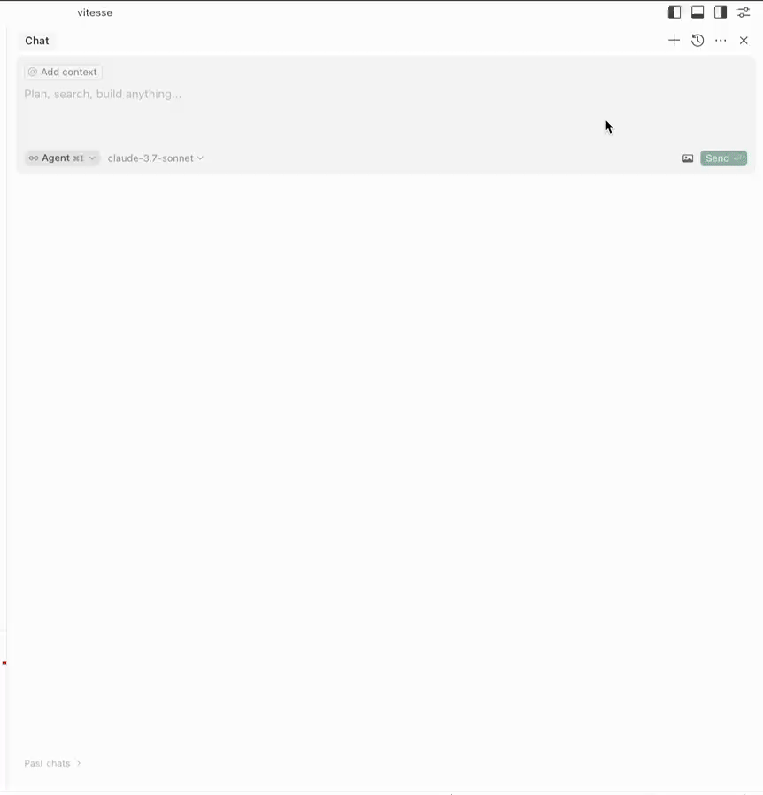
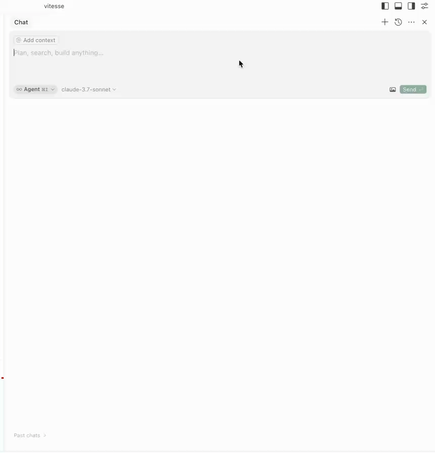
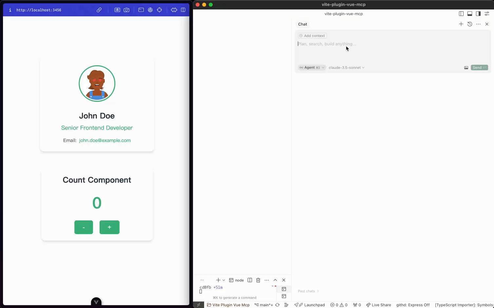
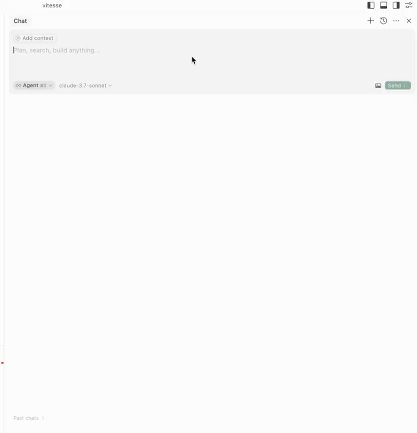
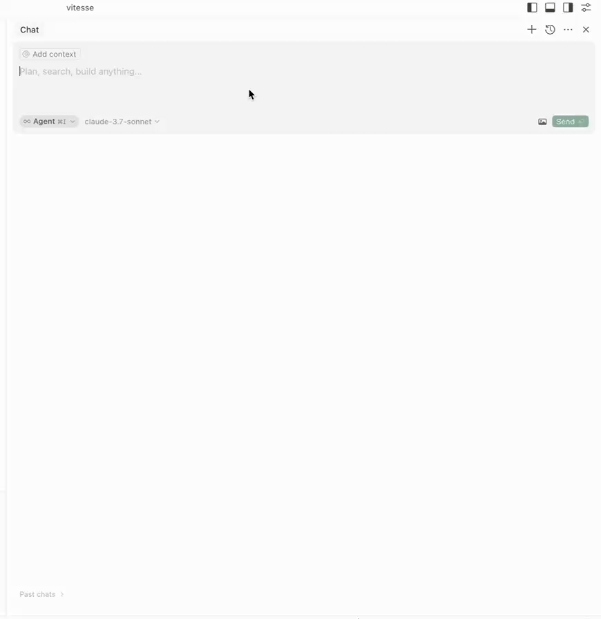
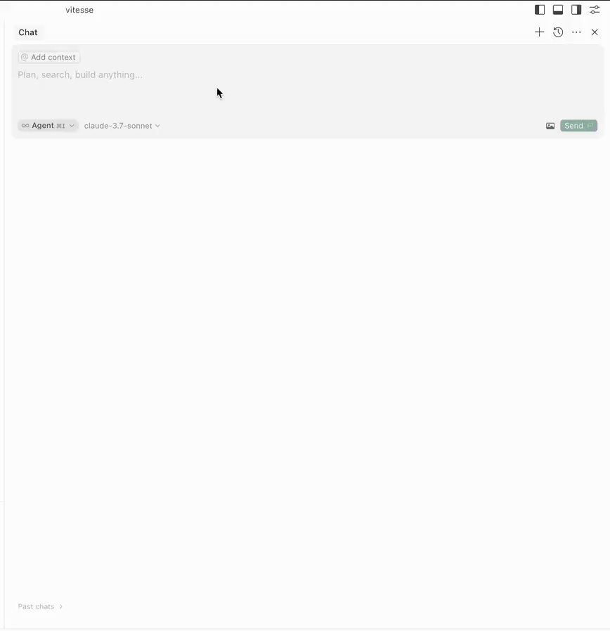
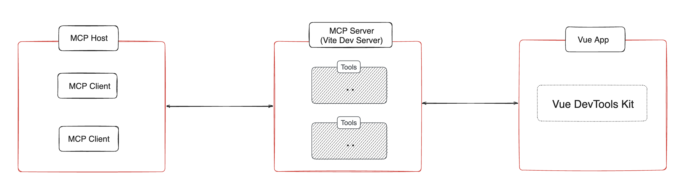

# vite-plugin-vue-mcp

[![npm version][npm-version-src]][npm-version-href]
[![npm downloads][npm-downloads-src]][npm-downloads-href]
[![bundle][bundle-src]][bundle-href]
[![License][license-src]][license-href]

Vite plugin that enables a MCP server for your Vue app to provide information about the component tree, state, routes, and pinia tree and state.

## Installation 📦

```bash
pnpm install vite-plugin-vue-mcp -D
```

## Usage 🔨

```ts
// vite.config.ts
import { VueMcp } from 'vite-plugin-vue-mcp'

export default defineConfig({
  plugins: [VueMcp()],
})
```

Then the MCP server will be available at `http://localhost:[port]/__mcp/sse`.

If you are using Cursor, create a `.cursor/mcp.json` file in your project root, this plugin will automatically update it for you. For more details about the MCP, check the [official Cursor documentation](https://docs.cursor.com/context/model-context-protocol).

### Options

```ts
export interface VueMcpOptions {
  /**
   * The host to listen on, default is `localhost`
   */
  host?: string

  /**
   * Print the MCP server URL in the console
   *
   * @default true
   */
  printUrl?: boolean

  /**
   * The MCP server info. Ingored when `mcpServer` is provided
   */
  mcpServerInfo?: McpServerInfo

  /**
   * Custom MCP server, when this is provided, the built-in MCP tools will be ignored
   */
  mcpServer?: (viteServer: ViteDevServer) => Awaitable<McpServer>

  /**
   * Setup the MCP server, this is called when the MCP server is created
   * You may also return a new MCP server to replace the default one
   */
  mcpServerSetup?: (server: McpServer, viteServer: ViteDevServer) => Awaitable<void | McpServer>

  /**
   * The path to the MCP server, default is `/__mcp`
   */
  mcpPath?: string

  /**
   * Update the address of the MCP server in the cursor config file `.cursor/mcp.json`,
   * if `.cursor` folder exists.
   *
   * @default true
   */
  updateCursorMcpJson?: boolean | {
    enabled: boolean
    /**
     * The name of the MCP server, default is `vue-mcp`
     */
    serverName?: string
  }

  /**
   * append an import to the module id ending with `appendTo` instead of adding a script into body
   * useful for projects that do not use html file as an entry
   *
   * WARNING: only set this if you know exactly what it does.
   * @default ''
   */
  appendTo?: string | RegExp
}
```

## Features/Tools ✨

### Get Component Tree

`get-component-tree`: Get the Vue component tree.



### Get Component State

`get-component-state`: Get the state of a component (input: `componentName`).



### Edit Component State

`edit-component-state`: Edit the state of a component (input: `componentName`, `path`, `value`, `valueType`).


### Highlight Component

`highlight-component`: Highlight a component (input: `componentName`).



### Get Routes

`get-router-info`: Get the Vue router info of the application.



### Get Pinia Tree

`get-pinia-tree`: Get the Pinia tree of the application.



### Get Pinia State

`get-pinia-state`: Get the Pinia state of the application (input: `storeName`).



## Architecture ⚡️



## Notice 💡

**Please ensure the application is running in your browser before using the features.**

## Credits 💖

This project is inspired by [vite-plugin-mcp](https://github.com/antfu/nuxt-mcp/tree/main/packages/vite-plugin-mcp). Thanks to [@antfu](https://github.com/antfu) for the great work.

## License 📖

[MIT](./LICENSE) License © [Arlo](https://github.com/webfansplz)

<!-- Badges -->

[npm-version-src]: https://img.shields.io/npm/v/vite-plugin-vue-mcp?style=flat&colorA=080f12&colorB=1fa669
[npm-version-href]: https://npmjs.com/package/vite-plugin-vue-mcp
[npm-downloads-src]: https://img.shields.io/npm/dm/vite-plugin-vue-mcp?style=flat&colorA=080f12&colorB=1fa669
[npm-downloads-href]: https://npmjs.com/package/vite-plugin-vue-mcp
[bundle-src]: https://img.shields.io/bundlephobia/minzip/vite-plugin-vue-mcp?style=flat&colorA=080f12&colorB=1fa669&label=minzip
[bundle-href]: https://bundlephobia.com/result?p=vite-plugin-vue-mcp
[license-src]: https://img.shields.io/github/license/webfansplz/vite-plugin-vue-mcp.svg?style=flat&colorA=080f12&colorB=1fa669
[license-href]: https://github.com/webfansplz/vite-plugin-vue-mcp/blob/main/LICENSE
